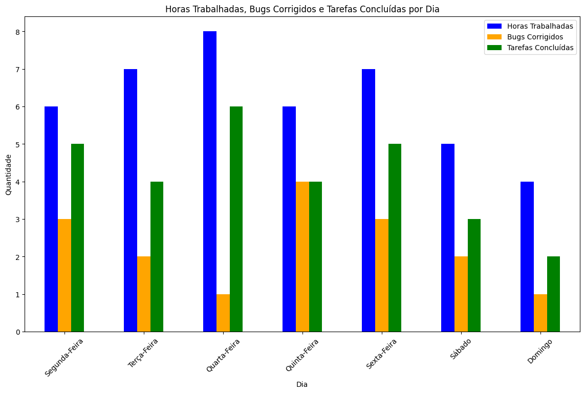
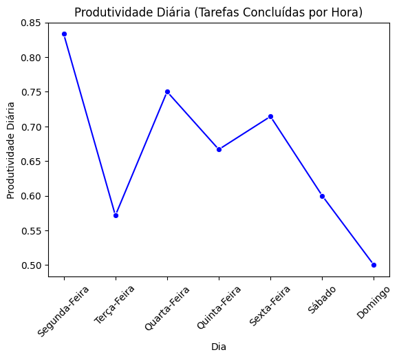

# TrabIndividualMod3
Trabalho individual número 3 do curso programadores cariocas no mercado do seguro, CNSeg 2024
# RelatoriosDeProgresso
Módulo 3 | Projeto Individual | Relatórios de Progresso | [Notebook](https://colab.research.google.com/drive/1bKvmnF5_3zhRbT0dZPPf5VEPhFauV3py?usp=sharing)

# Contexto
Uma empresa de desenvolvimento de softwares possui uma tabela com os seguintes dados e deseja um RELATÓRIO que você irá ajudar a construir!

| Dia           | Horas Trabalhadas | Bugs Corrigidos | Tarefas Concluídas |
|---------------|-------------------|-----------------|--------------------|
| Segunda-Feira | 6                 | 3               | 5                  |
| Terça-Feira   | 7                 | 2               | 4                  |
| Quarta-Feira  | 8                 | 1               | 6                  |
| Quinta-Feira  | 6                 | 4               | 4                  |
| Sexta-Feira   | 7                 | 3               | 5                  |
| Sábado        | 5                 | 2               | 3                  |
| Domingo       | 4                 | 1               | 2                  |

Este relatório tem o objetivo de demonstrar a importância da análise dos dados de um projeto de desenvolvimento de software ao longo de uma semana. Os dados fornecidos permitirão ao proprietário da equipe de desenvolvimento obter insights sobre o progresso do projeto, identificar possíveis áreas de melhoria e tomar decisões informadas para garantir o sucesso do projeto.

# O que é para fazer?
Gerar um relatório de progresso diário para mostrar o quão produtivo está sendo o trabalho dos funcionários e incluir no relatório outros itens como:

➔ Total de Horas Trabalhadas

➔ Média Diária de Horas Trabalhadas

➔ Total de Bugs Corrigidos

➔ Média Diária de Bugs Corrigidos

➔ Total de Tarefas Concluídas

➔ Média Diária de Tarefas Concluídas

➔ Produtividade Diária (Tarefas Concluídas por Hora)

# Resultados e Visualizações

### Métricas Calculadas

- **Total de Horas Trabalhadas**: 43 horas
- **Média Diária de Horas Trabalhadas**: 6,14 horas
- **Total de Bugs Corrigidos**: 16 bugs
- **Média Diária de Bugs Corrigidos**: 2,29 bugs
- **Total de Tarefas Concluídas**: 29 tarefas
- **Média Diária de Tarefas Concluídas**: 4,14 tarefas

### Horas Trabalhadas, Bugs Corrigidos e Tarefas Concluídas por Dia

### Produtividade Diária (Tarefas Concluídas por Hora)

## Conclusões e Insights

- **Total de Horas Trabalhadas, Bugs Corrigidos e Tarefas Concluídas**: O gráfico compara essas métricas, o que ajuda a identificar dias com desequilíbrio entre esforço e resultados.
- **Produtividade Diária**: O gráfico destaca a eficiência da equipe por dia, facilitando a identificação de dias mais/menos produtivos.
